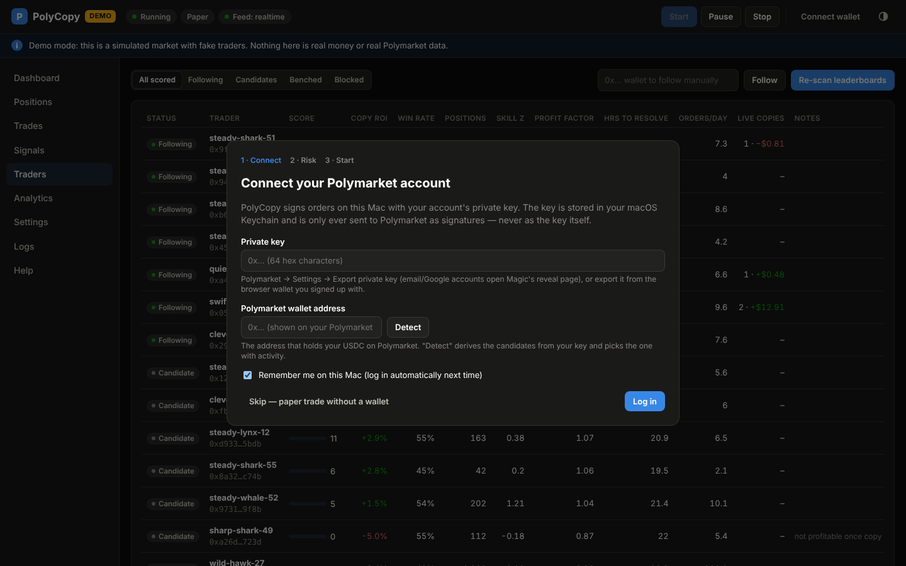
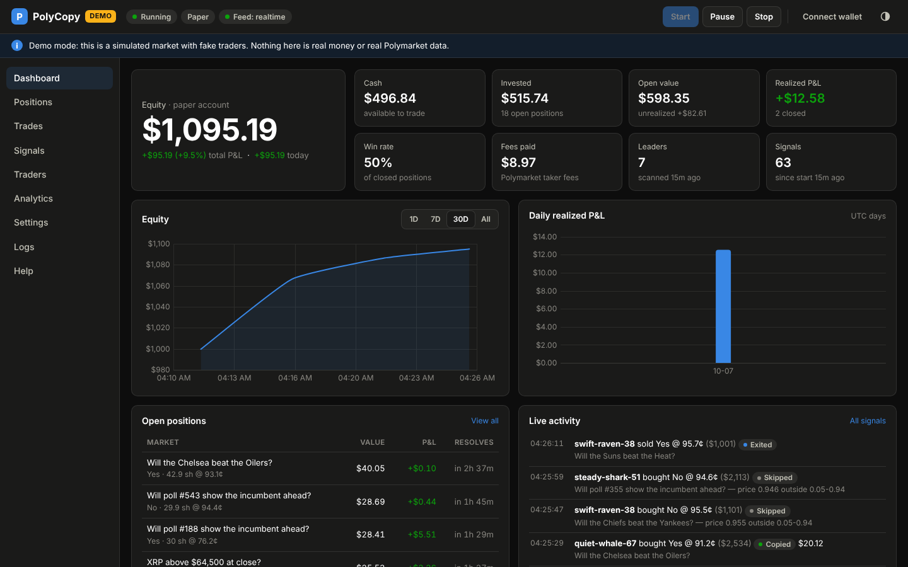
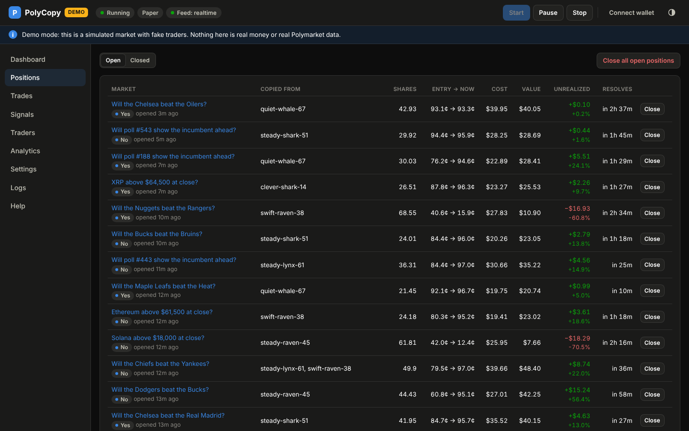
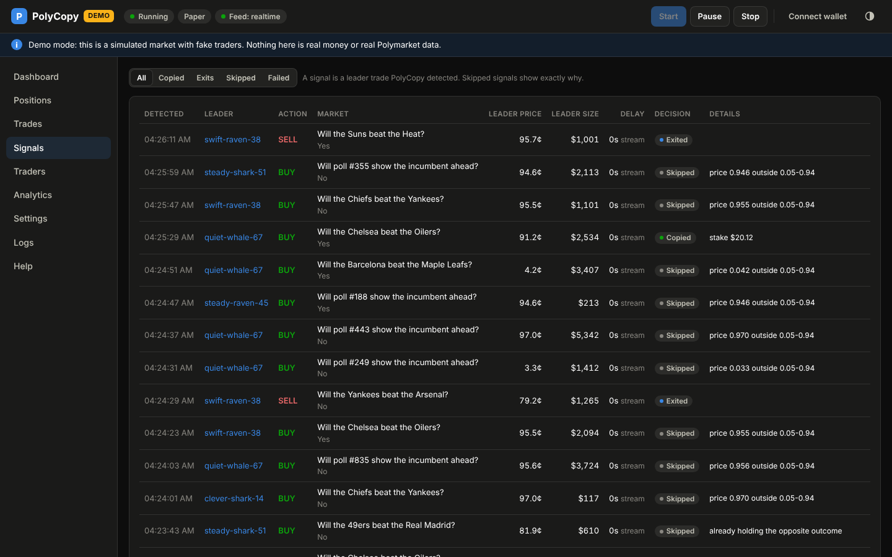
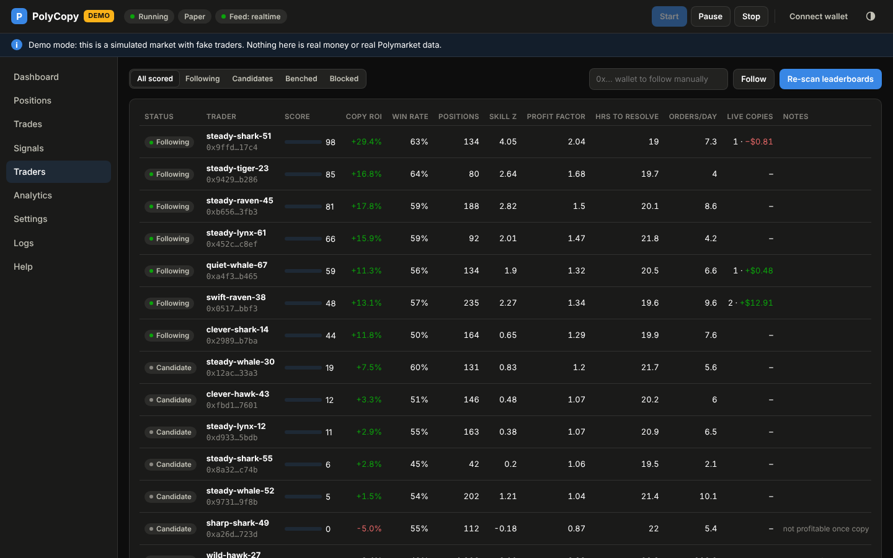
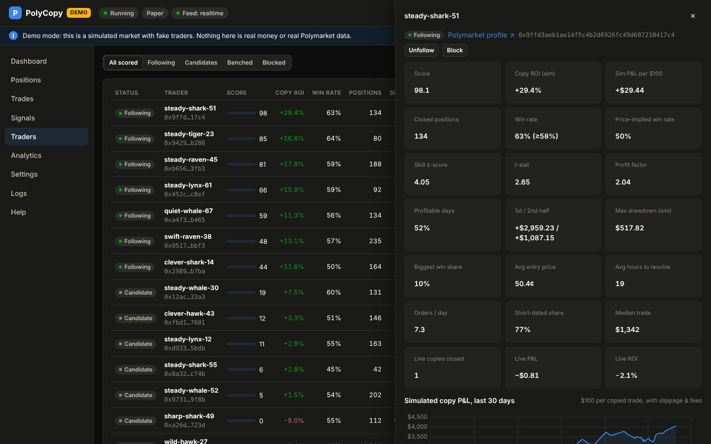
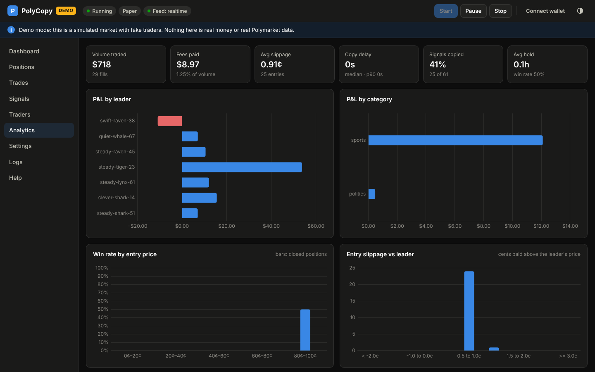
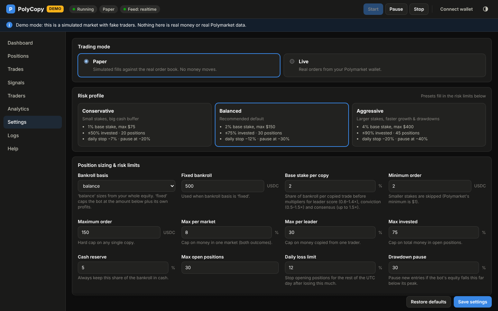

# PolyCopy — User Guide

PolyCopy copies the trades of consistently profitable Polymarket traders into your own
Polymarket account, but only in markets that settle within two days. It has two parts:

1. **The PolyCopy server.** A program that runs on your Mac and does all the work: it finds
   and scores traders, watches the ones it follows, places and exits trades, claims winnings
   and enforces your risk limits.
2. **The web terminal.** A dashboard in your browser at `http://127.0.0.1:8765`, served by
   the server. It shows everything the bot is doing and lets you control it.

Once you have logged in, PolyCopy runs on its own. This guide covers installation, every
screen and setting, daily use and troubleshooting. The reasoning behind the strategy is in
[STRATEGY.md](STRATEGY.md).

> **Read this first.** Trading on prediction markets can lose money, and copying traders who
> did well in the past does not guarantee future profit. Start in **Paper** mode, which
> simulates trades against the real order book without moving any money, and only switch to
> **Live** once the paper results convince you. Only use PolyCopy where you are legally
> allowed to use Polymarket. See [Location restrictions](#location-restrictions).

---

## Contents

1. [What you need](#1-what-you-need)
2. [Installing PolyCopy](#2-installing-polycopy)
3. [First launch: the setup wizard](#3-first-launch-the-setup-wizard)
4. [What happens after you press Start](#4-what-happens-after-you-press-start)
5. [The web terminal, screen by screen](#5-the-web-terminal-screen-by-screen)
6. [Settings reference](#6-settings-reference)
7. [Day-to-day operation](#7-day-to-day-operation)
8. [Going live: checklist](#8-going-live-checklist)
9. [Testing the strategy on real data (backtest)](#9-testing-the-strategy-on-real-data-backtest)
10. [Security and privacy](#10-security-and-privacy)
11. [Troubleshooting](#11-troubleshooting)
12. [Files, logs and uninstalling](#12-files-logs-and-uninstalling)
13. [FAQ](#13-faq)

---

## 1. What you need

- A Mac running macOS 12 (Monterey) or newer, Apple Silicon or Intel.
- A steady internet connection. PolyCopy reacts to trades within seconds, so the Mac should
  stay awake and online while it trades (see [Keeping the Mac awake](#keeping-the-mac-awake)).
- A **Polymarket account funded with USDC.** Deposits and withdrawals are done on
  polymarket.com as usual. PolyCopy trades with whatever cash is in the account, or with a
  fixed portion of it if you choose that.
- The account's **private key** and **wallet address** (explained in
  [step 3](#3-first-launch-the-setup-wizard)).

Paper trading needs no Polymarket account at all.

---

## 2. Installing PolyCopy

### Option A: the double-click launcher (recommended)

1. Get the PolyCopy folder onto your Mac. Either:
   - on the GitHub page press **Code → Download ZIP** and unzip it (for example into
     `Documents`), or
   - run `git clone <repository-url>` in Terminal.
2. Open the folder in Finder and **double-click `Start PolyCopy.command`**.
   - The first time, macOS may say it cannot verify the developer. Right-click (or
     Control-click) the file, choose **Open**, then confirm **Open**. You only need to do
     this once.
3. A Terminal window opens. On the first launch PolyCopy installs
   [uv](https://docs.astral.sh/uv/), a small tool that downloads Python 3.12 and PolyCopy's
   pinned dependencies into the PolyCopy folder. This takes about a minute and does not touch
   the rest of your system. Later launches take a few seconds.
4. Your browser opens the web terminal at `http://127.0.0.1:8765`. If it does not, open
   that address yourself.

**Keep the Terminal window open.** It *is* the server. Closing it, or pressing Ctrl+C in it,
stops the bot.

`Start PolyCopy Demo.command` launches the same program against a built-in **simulated
market** with fake traders and fake money. Use it to explore the interface without any risk.
Demo data is stored separately from real data.

### Option B: the standalone executable

If you prefer a single program with no installation step:

- **Download a build.** Every push to the repository builds a macOS (Apple Silicon)
  executable on GitHub. Open the repository's **Actions** tab, select the latest successful
  *Test & build macOS server* run and download the **PolyCopy-macos-arm64** artifact.
- **Or build it yourself:** run `scripts/build_macos_app.sh` from the PolyCopy folder. The
  result is `dist/PolyCopy/PolyCopy` (plus a zip of it).

Unzip the folder and double-click **`PolyCopy`** inside it (right-click → Open the first
time). It behaves exactly like the launcher. Keep the whole `PolyCopy` folder together,
because the executable needs the `_internal` folder next to it.

### Option C: from a terminal (for developers)

```bash
uv sync --locked --python 3.12
uv run polycopy                 # real mode
uv run polycopy --demo          # simulated market
uv run polycopy --port 9000     # use another port
uv run polycopy --no-browser    # don't open the browser automatically
```

---

## 3. First launch: the setup wizard

The first time the web terminal opens, a three-step wizard appears.



### Step 1: connect your Polymarket account

PolyCopy needs two things.

**Private key.** This is the key that controls your Polymarket wallet. PolyCopy uses it to
sign orders on your Mac. It is stored in the macOS Keychain and is never sent anywhere: only
signatures go to Polymarket. How you get it depends on how you signed up for Polymarket:

| You signed up with… | Where to get the key |
|---|---|
| Email or Google | In Polymarket, open the profile menu → **Settings** → **Export Private Key**. This opens Magic's key-reveal page (`reveal.magic.link/polymarket`). Log in with the same email or Google account and copy the key. |
| A browser wallet (MetaMask, Rabby, Coinbase Wallet…) | Export that wallet account's private key from the wallet extension (for MetaMask: account menu → **Account details** → **Show private key**). |

If your account offers no way to export a key, PolyCopy cannot trade it. In that case,
create a fresh browser wallet, sign in to Polymarket with it, move funds to that account and
use its key. It is good practice anyway to give the bot **a dedicated account holding only
what you want it to trade**.

**Polymarket wallet address.** Polymarket keeps your funds in a smart wallet derived from
your key (a *proxy*, *Safe* or *deposit wallet*, depending on when and how you signed up).
Its address is the one shown on your Polymarket profile and deposit screen. Either:

- paste it, or
- press **Detect**. PolyCopy derives every wallet your key could control, checks each for
  activity and balance, and fills in the most likely one.

Leave **Remember me** ticked to log in automatically on future launches. Press **Log in**.
PolyCopy then:

- creates (or re-derives) your Polymarket trading API credentials,
- checks your USDC balance,
- checks the token approvals your wallet needs for trading, and sets up a Polymarket
  *builder key* so it can claim winnings gas-free,
- checks whether Polymarket allows trading from your location.

Prefer to try it first? **Skip — paper trade without a wallet** continues without logging
in. Live trading stays disabled until you connect a wallet.

### Step 2: choose how much risk

Pick a risk profile:

| Profile | Base stake per copy | Max single order | Max invested | Daily stop | Pause at drawdown |
|---|---|---|---|---|---|
| Conservative | 1% of bankroll | $75 | 50% | −7% | −20% |
| **Balanced** (default) | 2% | $150 | 75% | −12% | −30% |
| Aggressive | 4% | $400 | 90% | −20% | −40% |

Then choose the **bankroll** the bot may use:

- **My whole Polymarket balance.** Stakes are sized from the account's total equity.
- **Only N USDC.** The bot behaves as if it had N USDC plus whatever profit it has made, and
  never uses more of your balance than that.

### Step 3: paper or live

- **Paper trading** (recommended for the first days) copies leaders against the **real,
  live order book** with simulated money, including real slippage and fees. It is the honest
  way to see what live trading would have done.
- **Live trading** places real orders. You have to tick the risk acknowledgement.

Press **Start the bot**. That is the last thing you have to do.

---

## 4. What happens after you press Start

1. **Leader discovery (first few minutes).** PolyCopy reads Polymarket's profit leaderboards
   (overall, sports and crypto; weekly and monthly), downloads each candidate's last 30 days
   of trades and replays them *as if you had copied them*. A progress bar on the dashboard
   shows *"Finding traders to copy"*. The first scan of about 300 wallets takes a few
   minutes; later scans are faster because resolved markets are cached. It repeats every 6
   hours.
2. **Following.** The best-scoring wallets (up to 12) are followed. They appear under
   **Leaders being copied** on the dashboard and as *Following* in the Traders tab.
3. **Watching.** PolyCopy listens to Polymarket's realtime trade feed, and also polls each
   leader every few seconds, so a leader's trade is usually detected within 1–5 seconds.
4. **Deciding.** Each detected trade becomes a *signal* that passes through the entry
   filters (market ends within 48 hours, price hasn't run away, enough liquidity, risk limits
   allow…). It is then either **copied** or **skipped**, and the reason is shown.
5. **Managing.** When a leader sells, PolyCopy sells the same fraction of what it copied from
   that leader. When a market resolves, the position settles and live winnings are claimed
   back to USDC automatically.
6. **Learning.** Every leader's *live* copy results are tracked. A leader whose copies keep
   losing is benched for a week automatically.

It is normal to see **many skipped signals**. Most of what top traders do is in long-dated
markets, at prices too close to 0 or 100¢, or moves the price before a copy could get the
same deal. PolyCopy is deliberately picky, because copying those trades loses money.

---

## 5. The web terminal, screen by screen

### Header bar

- **Status pill**: *Running* (copying), *Paused* (managing existing positions, not opening
  new ones) or *Stopped* (nothing running).
- **Mode pill**: *Paper* or *LIVE*.
- **Feed pill**: *realtime* means the live trade stream is connected; *polling* means
  PolyCopy fell back to checking every few seconds (works, just slower).
- **Start / Resume, Pause, Stop.** Pause stops new entries but keeps mirroring exits and
  settling positions. Stop halts everything; open positions stay open in your wallet.
- **Wallet chip**: your wallet and cash. Click it to connect a wallet, or to open the account
  settings.
- **Theme toggle**: light or dark.

Coloured **banners** below the header explain anything that needs attention: demo mode,
location restrictions, an automatic pause and its reason, a disconnected feed, no leaders
yet, and so on.

### Dashboard



- **Equity**: cash plus the current value of the bot's positions. The line below shows total
  P&L (amount and % of starting capital) and today's P&L.
- **Tiles**:
  - **Cash**: available USDC, plus winnings waiting to be claimed.
  - **Invested**: cost of open positions.
  - **Open value**: what the open positions are worth now.
  - **Realized P&L**: closed positions only.
  - **Win rate**: share of closed positions that made money.
  - **Fees paid**: Polymarket taker fees.
  - **Leaders**: number followed, and when they were last scanned.
  - **Signals**: leader trades detected since start.
- **Equity chart**: 1D / 7D / 30D / All. A point is recorded every 5 minutes; hover for exact
  values.
- **Daily realized P&L**: one bar per UTC day. Blue bars are gains, red bars are losses.
- **Open positions**: the eight most recent, with value, unrealized P&L and time to
  resolution.
- **Live activity**: each leader trade as it happens, with PolyCopy's decision.
- **Leaders being copied**: click any leader for details.

### Positions



- **Open**:
  - **Market**: links to Polymarket; shows the outcome held and when the position opened.
  - **Copied from**: which leaders the position was copied from.
  - **Shares**, **Entry → now** (average entry price and current price), **Cost**, **Value**.
  - **Unrealized**: P&L in $ and %.
  - **Resolves**: expected settlement time. For sports this is kickoff + 6h, or the market's
    end date if that is sooner.
  - **Close**: sells the whole position at the current best bid.
  - An **exit pending** tag means a leader sold but there were no buyers near their price;
    PolyCopy keeps retrying for 30 minutes, then holds the position to resolution.
  - **Close all open positions** sells everything (with confirmation).
- **Closed**:
  - **Result**: *Won*, *Lost*, *Sold* (exited before resolution) or *50/50*.
  - **Entry price**, **Invested**, **Realized** P&L, **ROI**, and how long the position was
    held.
  - A **to claim** tag (live mode) means the market resolved in your favour but the winnings
    have not been redeemed yet. PolyCopy retries automatically; you can also press Claim on
    polymarket.com.

### Trades

Every order PolyCopy placed:

- time, side, and why it was placed: *Copy entry*, *Leader exit*, *Leader exit
  (reconciled)*, *Take profit* or *Manual close*;
- fill price and the leader's price;
- **Slippage**: how many cents worse than the leader you filled;
- shares, USDC, fee, and status (*Filled*, *Partial* or *Failed*, with the error message).

### Signals



Every leader trade PolyCopy detected and what it did about it. The filters at the top show
**Copied**, **Exits**, **Skipped** or **Failed** signals. **Delay** is the time from the
leader's trade to detection, plus the source (*stream* or *poll*). **Details** shows the
stake, or the exact skip reason, for example:

- `price moved: best ask 0.612 > cap 0.592 (leader paid 0.570)` — the price ran away before a
  copy could match the leader's deal;
- `resolves in 112h (limit 48h)` — outside your two-day window;
- `price 0.962 outside 0.05-0.94` — too close to certain, with no upside left after costs;
- `game already in progress (in-play)` — live sports odds move faster than a copy can
  follow;
- `market exposure cap leaves only $1.20` — a risk limit was reached.

### Traders



Every wallet PolyCopy scored, with followed leaders first. Columns:

| Column | Meaning |
|---|---|
| Status | **Following**, Candidate, Benched (auto-paused after poor live results) or Blocked. A *manual* tag means you chose it. |
| Score | 0–100. Above ~40 qualifies. See [STRATEGY.md](STRATEGY.md#4-scoring-leaders). |
| Copy ROI | Return on the money a copier would have put in over the last 30 days, after slippage and fees. |
| Win rate | Share of copied positions that made money. |
| Positions | Closed copyable positions in the sample. 15 or more are required. |
| Skill z | How far the trader's win count beats what their entry prices implied. **Above 2 is strong evidence of real skill**, not luck. |
| Profit factor | Gross wins ÷ gross losses. |
| Hrs to resolve | Average time from their trade to settlement. |
| Orders/day | Very high values mean bots or market makers, which cannot be copied. |
| Live copies | Closed positions PolyCopy actually copied from this trader, and their P&L. |
| Notes | Why a wallet does not qualify, for example "not profitable once copy slippage and fees are included". |

Actions:

- **Follow / Unfollow / Block.** A manual follow always stays followed. A block is never
  followed.
- **Follow a wallet manually.** Paste any `0x…` address in the box and press Follow. It is
  scored in the background.
- **Re-scan leaderboards** runs discovery now.

Click a row to open the **trader detail drawer**:



It contains the full metric grid, a chart of what copying the trader would have earned over
the last 30 days ($100 per copied trade, after slippage and fees), their leaderboard ranks,
the kinds of trades the simulation would skip, open copies from this leader and their recent
trades. There is also a link to their Polymarket profile.

### Analytics



- **Tiles**:
  - **Volume traded**, **Fees paid** (and as % of volume).
  - **Avg slippage** versus the leader.
  - **Copy delay**: median and 90th percentile.
  - **Signals copied** (%) and **Avg hold** time.
- **P&L by leader** and **P&L by category** (sports, crypto…). Blue bars are profit, red bars
  are loss.
- **Win rate by entry price**: whether cheap or expensive entries are working.
- **Entry slippage histogram**: if most copies cost more than ~1.5¢, consider a smaller
  *Max chase*.
- **Why signals were skipped**: counts by reason.
- **Leader scorecard**: every leader's live copies, closed positions, win rate, invested,
  realized P&L and ROI.

### Settings



- **Trading mode**: Paper or Live (Live requires a login and a confirmation).
- **Risk profile** presets, and every individual setting (see the next section).
- **Paper account**: reset the simulated balance. Stop the bot first.
- **Account**: wallet, wallet type, USDC balance, approvals, whether winnings are
  auto-claimed, and where your key is stored. **Log out & forget key** removes the key from
  this Mac.
- **Server → Quit PolyCopy server** stops everything and closes the server.

Press **Save settings** after editing. **Restore defaults** resets every setting.

### Logs

A timestamped record of everything important:

- logins, copies and exits;
- resolutions (*WON* / *LOST*) and redemptions;
- automatic pauses and leader changes;
- warnings and errors.

Filter by level.

### Help

A short in-app version of this guide.

---

## 6. Settings reference

All money values are in USDC. Percentages are of the bankroll unless stated.

### Position sizing & risk limits

| Setting | Default | What it does |
|---|---|---|
| Bankroll basis | balance | `balance`: size from total equity. `fixed`: use at most the fixed bankroll plus the bot's own profits. |
| Fixed bankroll | 500 | Used with `fixed`. |
| Base stake per copy | 2% | Starting stake before multipliers (see STRATEGY §6). |
| Minimum order | $2 | Smaller stakes are skipped. Polymarket's minimum is $1. |
| Maximum order | $150 | Hard cap per copy. |
| Max per market | 8% | Cap on money in one market (both outcomes combined). |
| Max per leader | 30% | Cap on money copied from one trader. |
| Max invested | 75% | Cap on total money in open positions. |
| Cash reserve | 5% | Cash that is never used. |
| Max open positions | 30 | |
| Daily loss limit | 12% | New entries stop for the rest of the UTC day after this loss. |
| Drawdown pause | 30% | Pause new entries if bot equity falls this far below its peak. Needs a manual Resume. |

### Which trades get copied

| Setting | Default | What it does |
|---|---|---|
| Max hours until the market ends | 48 | **The two-day rule.** Sports use kickoff + 6h if that is sooner than the end date. |
| Min minutes until the market ends | 20 | Skips ultra-short markets dominated by millisecond bots. |
| Min / max entry price | 5¢ / 94¢ | Skips long shots and near-certainties. |
| Max chase | 2¢ | Never pay more than the leader's price plus this… |
| Max chase (relative) | 6% | …or more than 6% above it. The tighter of the two applies. |
| Max bid/ask spread | 6¢ | Skips illiquid books. |
| Max signal age | 120 s | Ignores stale detections. |
| Min leader trade size | $25 | Ignores tiny, low-conviction trades. |
| Min market liquidity | $500 | |
| Skip in-play sports | on | No copying into games already underway. |
| Allow adding to a position | on | Copies additional buys within the caps. |
| Skip conflicting signals | on | Never holds both outcomes of one market. |
| Excluded keywords | — | For example `Up or Down` to skip 5- and 15-minute crypto markets entirely. |

### Exits

| Setting | Default | What it does |
|---|---|---|
| Mirror leader sells | on | Sell the same fraction the leader sold, from that leader's copied shares. |
| Exit price tolerance | 4¢ | Accept up to this much below the leader's sell price. |
| Exit retry window | 30 min | Then hold to resolution. |
| Take profit at | off | Optional, for example 99¢: sell instead of waiting for settlement. |
| Auto-claim winnings | on | Redeem resolved winners to USDC (live). |

### Trader discovery & scoring

| Setting | Default | What it does |
|---|---|---|
| Re-scan every | 6 h | |
| Leaderboard windows | week, month | |
| Extra category leaderboards | sports, crypto | Any Polymarket category name works, e.g. `politics`. |
| Wallets per leaderboard / Max wallets scored | 150 / 300 | |
| History to replay | 30 days | |
| Min closed positions | 15 | Sample-size floor. |
| Min score to follow | 40 | |
| Max leaders followed | 12 | |
| Simulated copy slippage | 1¢ | Assumed fill disadvantage versus the leader. |
| Max leader orders/day | 150 | Above this, a wallet is treated as a bot or market maker. |
| Min short-dated share | 25% | Share of a trader's volume that must match your filters. |
| Bench below live ROI / after N copies | −15% / 8 | Automatic benching for one week. |

### Detection and startup

- **Realtime trade feed** (on), **Poll interval** (4 s) and **Fill grouping window**
  (1.5 s; the many fills of one leader order become one signal).
- **Resume automatically** (on): after a relaunch, log in and resume if the bot was running.

---

## 7. Day-to-day operation

### Starting and stopping

- Launch PolyCopy as in [section 2](#2-installing-polycopy). If it was running when you
  quit, it logs in and resumes on its own.
- To stop: **Settings → Quit PolyCopy server**, or Ctrl+C in the Terminal window, or close
  that window.
- Open positions stay in your Polymarket wallet when PolyCopy is off. They are managed again
  (exits mirrored, settlements and claims) the next time it runs.

### Keeping the Mac awake

PolyCopy can only react while the Mac is awake and online. Either:

- **System Settings → Battery** (or *Energy*) → enable *Prevent automatic sleeping when the
  display is off* while on power, or
- open a second Terminal window and run `caffeinate -dims`. It keeps the Mac awake until you
  press Ctrl+C.

A lid-closed MacBook sleeps unless it is connected to power and an external display. A Mac
mini or desktop Mac makes the most reliable PolyCopy host.

### Adding or withdrawing money

Deposit and withdraw on polymarket.com as usual. PolyCopy picks up the new balance within
about 20 seconds. With **Bankroll basis = fixed**, deposits do not increase the bot's stakes.

### A sensible routine

- **Daily:** glance at the dashboard and **Analytics → Leader scorecard**. Block a leader
  whose style you dislike.
- **Weekly:** compare live results with the leaders' simulated results. If slippage is large
  or few signals get copied, tune the filters (for example *Max chase*) instead of loosening
  everything at once.

---

## 8. Going live: checklist

1. Run in **Paper** mode for at least 3–7 days, or until there are 50+ closed positions.
2. Check **Analytics**:
   - Is realized P&L positive after fees?
   - Is the average slippage around 1¢ or less?
   - Do several leaders contribute, rather than one lucky one?
3. Optionally run the [backtest](#9-testing-the-strategy-on-real-data-backtest).
4. Fund a dedicated Polymarket account with an amount you can afford to lose. Consider
   **Bankroll basis = fixed** with a small amount to start.
5. **Settings → Trading mode → Live** (confirm). Watch the first live copies in **Trades**:
   fill prices should resemble the paper fills.
6. Scale up gradually, only if live results track paper results.

---

## 9. Testing the strategy on real data (backtest)

PolyCopy includes a **walk-forward backtest**:

1. It picks leaders using only data from 60 to 30 days ago.
2. It measures what copying them would have earned over the last 30 days.
3. It compares that with copying every candidate, and with copying the top wallets by raw
   profit.

From the PolyCopy folder:

```bash
uv run polycopy-backtest --out my-backtest.md
uv run polycopy-backtest --days 21 --candidates 150 --out quick.md    # faster
uv run polycopy-backtest --demo --out demo.md                         # offline, simulated
```

It takes a few minutes and writes a Markdown report. How to read the report is explained in
[STRATEGY.md §9](STRATEGY.md#9-demonstrating-the-strategy-walk-forward-backtest).

---

## 10. Security and privacy

- **Your private key** is stored in the **macOS Keychain** (encrypted by macOS, unlocked with
  your login). It never leaves your Mac. PolyCopy signs orders locally, and only signatures
  and API requests go to Polymarket. *Log out & forget key* deletes it.
- **The web terminal only listens on `127.0.0.1`**, so other computers cannot reach it. It
  also rejects requests from other websites and from unexpected host names, so a malicious
  page in your browser cannot control the bot.
- PolyCopy has **no accounts, telemetry or servers of its own**. Everything stays in its data
  folder on your Mac.
- Never paste your private key anywhere else, and never share screenshots of it.
- Use a dedicated Polymarket account for the bot, funded with only what it should trade.

### Location restrictions

Polymarket does not allow trading from some countries and regions. PolyCopy checks
Polymarket's location endpoint when you log in and every few hours:

- If you are restricted, a red banner appears and **live orders are not placed**. Paper mode
  still works.
- Do not use a VPN or other means to get around the restriction. That breaks Polymarket's
  terms and can get funds frozen.

---

## 11. Troubleshooting

| Symptom | What to do |
|---|---|
| macOS: *"cannot be opened because the developer cannot be verified"* | Right-click the file → **Open** → **Open**. Or run `xattr -dr com.apple.quarantine <folder>` once. |
| Browser didn't open | Go to `http://127.0.0.1:8765` (or the address printed in the Terminal window). |
| *"Port 8765 is busy"* | Another program uses it. PolyCopy picks the next free port automatically and prints the address. If PolyCopy is already running, the launcher opens the existing one. |
| Login: *"wallet address is required"* | Paste your Polymarket address or press **Detect**. |
| Login fails / *"does not exist"* | The address is not one your key controls. Use **Detect**, or check that you exported the key of the account that owns this Polymarket profile. |
| Red banner: location restricted | See [Location restrictions](#location-restrictions). |
| *"account is in close-only mode"* | Polymarket has limited the account. Contact Polymarket support. |
| *"No leaders are being followed yet"* | Wait for the first scan to finish, which takes a few minutes. If it finishes with zero leaders, no wallet passed the bar under your filters: try **Re-scan**, add categories, or raise *Max hours until the market ends*. |
| Lots of *Skipped* signals | Normal; see [section 4](#4-what-happens-after-you-press-start). The Analytics tab shows which reasons dominate. |
| *"price moved past cap"* is the top skip reason | Leaders' trades move the price. Raising *Max chase* copies more, but each copy has less edge. Change it in small steps and compare paper results. |
| Order *Failed* with *not enough balance* | Not enough USDC. Deposit, or lower stakes. |
| Order *Failed* with *fak_not_filled* | Nobody was selling at or below the cap at that moment. Nothing was bought; nothing to do. |
| *"to claim"* tags stay | Automatic claiming needs a builder key (created at login). If it could not be created, a yellow banner says so: claim on polymarket.com (Portfolio → Claim). |
| *Feed: polling* instead of *realtime* | The realtime stream is unreachable. Copies still work via polling, just a few seconds slower. |
| The bot paused itself | The banner says why (daily loss limit or drawdown). Review, then press **Resume**. |
| Something else | Open **Logs** (filter *Errors*) or the log file (next section). |

---

## 12. Files, logs and uninstalling

PolyCopy stores everything in `~/Library/Application Support/PolyCopy/`:

| File | Contents |
|---|---|
| `settings.json` | Your settings. |
| `polycopy.db` | Trades, positions, signals, traders and equity history (SQLite). |
| `polycopy.log` | Technical log, rotated at 5 MB. |
| `demo/` | Everything from demo mode, kept separate. |

Your private key is **not** in this folder. It is in the Keychain, under the item
"PolyCopy".

**To uninstall:**

1. Quit PolyCopy and log out in Settings, which removes the key from the Keychain.
2. Delete the PolyCopy folder and `~/Library/Application Support/PolyCopy/`.

To remove uv as well, delete `~/.local/bin/uv` and `~/.local/share/uv`.

---

## 13. FAQ

**Does PolyCopy guarantee profit?**
No. It is built to give you the best odds it can (see STRATEGY.md), but markets change,
skilled traders have losing streaks, and copying always has some delay and slippage. Use
money you can afford to lose.

**How much money do I need?**
Paper mode needs none. Live, $200–$500 is enough to start at the default 2% base stake (about
$4–$10 per copy). With very small balances the $1–$2 minimum order size makes many stakes too
small, and those signals are skipped.

**Why only markets that resolve within two days?**
That is what you asked for, and it has real benefits:

- capital comes back quickly;
- results (and bad leaders) show up fast;
- you are rarely stuck in a position for weeks.

**Will leaders know I'm copying them?**
Your trades are public on-chain like everyone's, but PolyCopy's sizes are small relative to
the leaders it picks.

**Can I copy a specific trader I like?**
Yes. Use **Traders → Follow** with their wallet address. Manual follows are always copied,
but still go through all the filters and risk limits.

**Can I run it on Windows or Linux?**
The server is cross-platform Python (`uv run polycopy`). Only the launcher and the packaged
executable are macOS-specific.

**Does it trade while my Mac sleeps?**
No. See [Keeping the Mac awake](#keeping-the-mac-awake).
